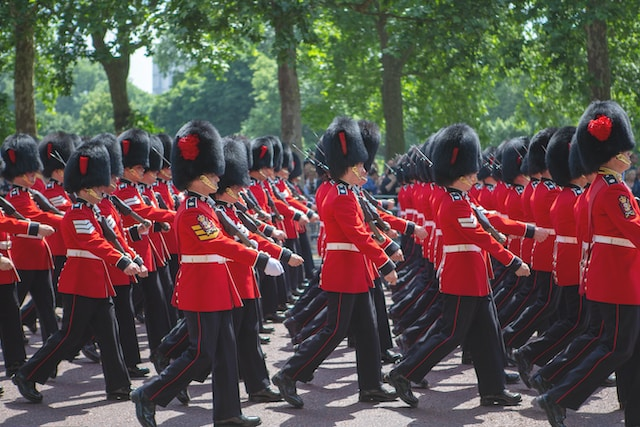

# PEP 201 – Lockstep Iteration

## What does lockstep mean?

[Lockstep](https://en.wikipedia.org/wiki/Lockstep) is marching in a very close
formation with synchronized steps.

<!-- Photo by <a href="https://unsplash.com/@mrmarkdejong?utm_source=unsplash&utm_medium=referral&utm_content=creditCopyText">Mark de Jong</a> on <a href="https://unsplash.com/photos/YN1bBaxtqJg?utm_source=unsplash&utm_medium=referral&utm_content=creditCopyText">Unsplash</a> -->

